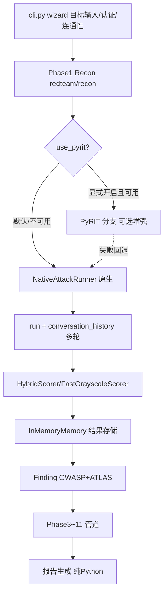

## 用户需求

当前 PyRIT（0.14.0 scanner API）集成卡死，整条 AI 红队流水线跑不通。用户需要一条**完全不依赖 PyRIT** 也能完成 OffSec AI-300 / OSAI 考试备考的可用路径，同时保留现有 YAML 数据驱动、红队专家横幅、OWASP+ATLAS 强制分类等差异化能力。

## 产品概览

将 RedTeam-AI 的定位从"PyRIT 封装"切换为"**原生优先（Native-First）的纯 Python AI 红队引擎**"：PyRIT 降级为可选增强，缺失时仅友好提示，绝不阻断流程。Phase 1~11 全链路在仅安装 httpx/pydantic/pyyaml/rich/jinja2 的环境即可跑通。

## 核心特性

- 全流水线原生化：侦察→注入→Agent→RAG→Embedding→供应链→基础设施→威胁建模→报告，零 PyRIT 依赖可完整运行。
- 真实多轮攻击：原生 Crescendo/TAP/PAIR 携带累积对话历史（messages 数组），恢复考试 P0 多轮技术能力。
- 原生转换器链：base64/rot13/leetspeak/unicode/character_spacing/payload_splitting/translation 等纯 Python 实现，无运行时 PyRIT 导入。
- 分类不丢失：Finding 仍强制绑定 OWASPLlm + MITREATLASTactic（沿用 models.py）。
- 友好错误：PyRIT 缺失/失败时抑制 traceback，仅打印友好提示，符合 CLI 错误规范。
- 依赖最小化：PyRIT 移出硬依赖，归入 optional-dependencies（符合铁律 R6 / Library-First）。

## 技术栈选择

- 运行时依赖（必需）：Python >=3.11、httpx、pydantic v2、pyyaml、rich、jinja2、reportlab、python-docx（均为纯 Python 库，符合 Library-First）。
- PyRIT：从 `dependencies` 硬性依赖**移入** `[project.optional-dependencies]`（新增 `pyrit` 分组），成为可选增强。
- 复用现状：保留 `NativeAttackRunner`、`HybridScorer`/`FastGrayscaleScorer`、`InMemoryMemory`、YAML 场景/载荷体系与 Phase 1~11 管道结构，不重写架构。

## 实现方案

采用 **Native-First 解耦策略**：在不破坏现有分层管道的前提下，把 PyRIT 从"首选引擎"降级为"显式开启的增强分支"，并补全原生多轮的对话历史短板。

1. **依赖解耦**：`pyproject.toml` 将 `"pyrit>=0.13.0"` 从 `dependencies` 移至 `[project.optional-dependencies].pyrit`，使 `pip install .` 在无 PyRIT 时也能完成。核查所有模块确保 PyRIT 仅在函数内 `import`（现状 `runner.py:39`、`pyrit_runner.py` 等已是惰性导入），导入期不抛错。
2. **原生多轮补全**：当前 `NativeAttackRunner.send_prompt`（native_runner.py:201）调用 `self.run([payload])` 为独立单轮、不携带历史。新增 `conversation_history: list[dict[str,str]]` 参数，在 `run()` 中将历史 messages 与当前轮合并后发送，返回时回传更新后的历史，使 Crescendo 逐步升级具备真实上下文。
3. **编排层门控**：`pyrit_orchestrator.py` 的 `_run_crescendo_native/_run_tap_native/_run_pair_native` 改为逐轮传入累积 `conversation_history`；PyRIT 分支（`_run_*_pyrit`）仅当用户显式 `--use-pyrit` 且 `is_pyrit_available()` 为真时进入，失败时仍回退原生。
4. **默认值翻转**：`pipeline/runner.py`、`injection_phase.py`、`agent_phase.py`、`scenario/orchestrator.py` 中 `use_pyrit` 默认由 `is_pyrit_available()` 改为 `False`（原生优先），保留 `use_pyrit=True` 显式覆盖入口。
5. **纯 Python 校验**：确认 `converters.py`/`encoding_converters.py`/`jailbreak_converters.py` 无运行时 `import pyrit`（搜索已证实转换器无 PyRIT 依赖），评分走 `HybridScorer`/`FastGrayscaleScorer`。

### 性能与可靠性

- `native_runner.run()` 当前每次循环新建 `httpx.Client`（line 118），多轮/批量场景存在重复建连开销；改为在 `run()` 内复用单个 `httpx.Client` 实例（with 作用域覆盖整个 payload 循环），降低连接建立成本。
- 多轮历史随轮数线性增长，单次请求体受 `max_turns`（默认 5~10）约束，空间复杂度 O(turns)，可控。
- 全部外部调用（httpx、subprocess）保持 mock 化测试，合成数据，禁止真实凭据。

## 实现注意

- **禁止破坏现有铁律**：每处改动保留 `manual` 入口、Python fallback 常量、OWASP/ATLAS 绑定、阶段横幅风格。
- **Blast radius 控制**：仅改默认分支与门控逻辑，不重写攻击算法；PyRIT 路径保留为可选，不删除其代码。
- **错误抑制**：`cli.py` 主流程 `try/except typer.Exit` 已存在，补充 PyRIT 缺失提示文案，禁止向上抛 traceback。
- **日志**：复用 `logging.getLogger(__name__)`，PyRIT 回退仅 `logger.warning` 一次，避免噪声。

## 架构设计

保持现有分层管道，仅切换默认执行后端并增强原生多轮状态：



## 目录结构

## 目录结构摘要

本次改动聚焦"去 PyRIT 化 + 原生多轮增强"，涉及依赖声明、原生引擎、编排层、CLI 与文档/测试。

```
pyproject.toml                          # [MODIFY] 将 pyrit 从 dependencies 移入 optional-dependencies.pyrit
redteam/attack/core/native_runner.py    # [MODIFY] NativeAttackRunner.run/send_prompt 增加 conversation_history 参数，复用单 httpx.Client
redteam/scenario/pyrit_orchestrator.py  # [MODIFY] 原生多轮分支传累积历史；PyRIT 分支仅显式开启时进入
redteam/pipeline/runner.py              # [MODIFY] use_pyrit 默认 False
redteam/pipeline/injection_phase.py     # [MODIFY] use_pyrit 默认 False
redteam/pipeline/agent_phase.py         # [MODIFY] use_pyrit 默认 False
redteam/scenario/orchestrator.py        # [MODIFY] use_pyrit 默认 False（原生优先）
redteam/cli.py                          # [MODIFY] 向导默认原生模式；PyRIT 提示改为可选增强 [y/N] 默认 N
tests/                                   # [MODIFY/NEW] 在 pyrit 不可导入环境 pytest 零回归；mock httpx；覆盖原生多轮历史
docs/DEVELOPMENT_STANDARDS.md           # [MODIFY] 更新"原生优先"与依赖说明（pyrit: optional）
docs/COMMAND_REFERENCE.md               # [MODIFY] 同步 --use-pyrit 可选参数说明（如需）
```

## 关键代码结构

```python
# redteam/attack/core/native_runner.py
class NativeAttackRunner(AttackRunner):
    def run(
        self,
        payloads: list[str],
        converters: list[str] | None = None,
        conversation_history: list[dict[str, str]] | None = None,
    ) -> list[dict[str, Any]]:
        """执行原生攻击；conversation_history 为多轮累积 messages，单轮为 None。"""

    def send_prompt(
        self,
        payload: str,
        converters: list[str] | None = None,
        conversation_history: list[dict[str, str]] | None = None,
    ) -> PromptInjectionResult:
        """发送单条提示；可选携带历史以构造多轮上下文。"""
```