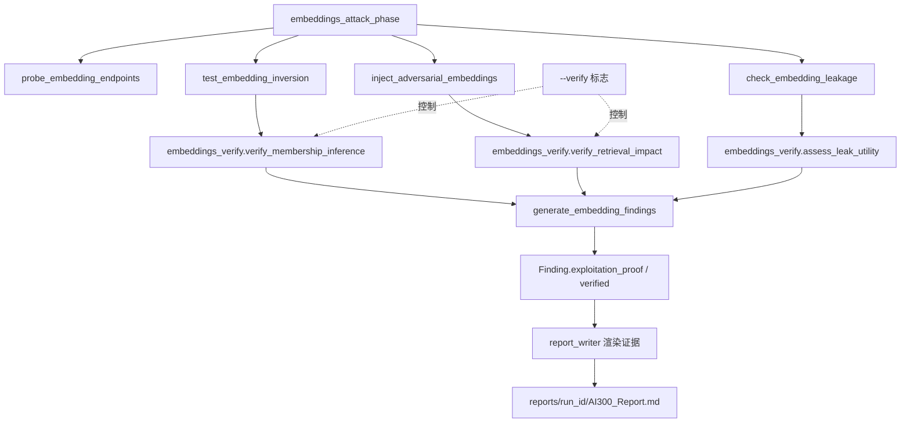

## 用户需求澄清

用户原主张「当前所有代码只是发现线索、没有攻击能力」需纠正为：**代码具备攻击执行能力（真实发送注入/越狱请求并用 LLM-as-Judge 评分），但 attack→exploit 的影响验证闭环不足**——多数 Finding 仅证明漏洞类「可达」，未证明「实际影响发生」。嵌入攻击阶段（AI-300 Ch6）最典型：仅做存在性检测。

## 产品概述

面向 OffSec AI-300 考试备考，将嵌入攻击阶段产出的「初步线索型 Finding」升级为「携带利用证明的 Finding」。通过纯原生（numpy + httpx）实现 impact-verification 闭环，使每个嵌入类发现具备可量化的利用证据，直接满足 OSAI 评分「漏洞发现 25%」与「证据完整性 20%」维度。

## 核心特性

- **成员/属性推断量化**：用余弦相似度对比候选文本嵌入与已知成员基线，产出置信度与反演候选，替代原 `std_dev < 0.15` 的粗糙启发式。
- **注入后检索验证闭环**：对抗性嵌入注入后发起检索查询，对比注入前后返回文档集合/响应差异，证明实际影响（而非仅 HTTP 200）。
- **泄露效用证明**：从响应提取真实 model/dims/tokenizer 值并说明其对攻击者的成本降低效用，替代原关键词命中计数。
- **Finding 模型承载证明**：新增 `exploitation_proof` 与 `verified` 字段，使报告可渲染请求/响应日志、相似度分数、检索前后 diff。
- **可复用验证模式**：验证逻辑沉淀为独立模块，其他 Phase 后续可沿用同一 impact-verification 模式。
- **向后兼容**：默认保持现状行为；新增 `--verify` 标志触发深度验证，不破坏现有流水线与报告结构。

## 技术栈选型

- 语言/运行时：Python >= 3.10（项目强制），类型提示 + Pydantic v2
- 网络层：httpx（沿用现有 `verify=False` 风格与 `auth.to_header_dict()` 模式）
- 向量计算：numpy（`statistics` 仅作回退，主用 numpy 余弦相似度）
- 数据模型：复用 `redteam/core/models.py` 的 `Finding` / `AIService` / `AuthContext`
- 配置驱动：复用 `config/payloads/llm08/` YAML 载荷库 + `config/scenarios/embeddings.yaml`
- 约束：**零外部框架依赖**，严禁 Garak/PyRIT 运行时调用（保持 Native-Only）；单模块 ≤500 行

## 实现方案

### 总体策略

在「检测」与「利用证明」之间插入一个纯原生的 **impact-verification 层**：每个攻击函数产出结构化 `proof`，由 `generate_embedding_findings` 写入 Finding 的 `exploitation_proof` 字段并置 `verified=True`（仅当影响被实际证明时）。`--verify` 标志控制是否执行该层，默认关闭以保证向后兼容与现有考试快照不变。

### 关键技术决策

1. **相似度推断而非模型反演**：真实嵌入反演需训练解码模型（违反 R6）。采用教科书式「余弦相似度成员/属性推断」——对候选文本获取嵌入 `e_c`，与已知成员基准集合 `{e_m}` 及非成员基线 `{e_n}` 计算平均相似度，取 `delta = mean_sim(e_c, members) - mean_sim(e_c, non_members)`，量化置信度。该方案纯 numpy 可实现、可复现、可解释，契合考试「证据完整」。
2. **检索前后 diff 闭环**：注入成功后向检索端点（探测到的 `/v1/query`、`/api/search`、`/search`）发中性查询（如「refund policy」），对比注入前（基线）与注入后的 top-k 文档列表/响应文本差异，差异命中注入指令即 `impact_verified=True`。检索端点不可达时标记 `impact_unverified` 并诚实记录，不做虚假断言。
3. **模块拆分控制行数**：`embeddings_attack.py` 当前 509 行（已接近上限）。将验证计算（相似度推断、检索 diff、泄露效用评估）抽到新模块 `redteam/attack/embeddings_verify.py`，`embeddings_attack.py` 仅保留探测/发送/汇总，避免超 500 行。
4. **YAML 驱动验证探针**：成员基线探针、检索验证查询以 YAML 存入 `config/payloads/llm08/`，保留 Python fallback 常量（R3），不在代码内硬编码目标文本。
5. **字段扩展非破坏性**：`Finding` 新增 `exploitation_proof: Optional[dict]` 与 `verified: bool = False`，旧 findings.json 反序列化兼容（默认值）。

### 性能与可靠性

- 相似度计算为 O(n·d)（n=基线样本数≈5，d=维度≈1536），开销可忽略；批量用 numpy 向量化避免 Python 循环。
- 检索验证仅触发 1~2 次额外 HTTP，受现有 `timeout` 与 `services[:3]` 上限约束，不放大爆炸半径。
- 所有外部调用 mock；numpy 计算用合成向量测试，禁止真实凭据/真实 URL（R6、测试规范）。

## 实现注意事项

- 复用现有 `auth.to_header_dict()`、`save_json/load_json`（`redteam/core/store.py`）、`print_section_header` 模式，不新造工具。
- 新增函数必须带 `manual` 参数（R3），并在 docstring 注明 AI-300 Ch6（R1）。
- YAML 中文引号使用 Unicode `\u201c\u201d`，禁止内层 ASCII `"`（避免 `yaml.safe_load` 失败）。
- 若 `cli.py` 的 `run` 命令新增 `--verify`，必须同步更新 `docs/COMMAND_REFERENCE.md`（Makefile 同步规则）。
- 不修改阶段顺序，不改动 OWASP LLM08/LLM04 与 MITRE ATLAS 映射（R2）。

## 架构设计



现有流水线架构不变，仅在攻击函数与 `generate_embedding_findings` 之间插入 `embeddings_verify` 验证层，并扩展 `Finding` 模型承载证明。

## 目录结构

```
redteam/
├── core/
│   └── models.py                    # [MODIFY] Finding 增加 exploitation_proof: Optional[dict]=None 与 verified: bool=False；补充 docstring 标注 AI-300 Ch6 证据维度
├── attack/
│   ├── embeddings_attack.py         # [MODIFY] test_embedding_inversion / inject_adversarial_embeddings / check_embedding_leakage 改为返回 proof 结构；新增 manual 参数与 Python fallback；调用 embeddings_verify
│   └── embeddings_verify.py         # [NEW] 纯原生验证层：verify_membership_inference（余弦相似度+置信度）、verify_retrieval_impact（注入前后 diff）、assess_leak_utility（提取真实值+效用说明）；全部 numpy + httpx，snake_case，单测友好
├── pipeline/
│   ├── embeddings_phase.py          # [MODIFY] 透传 proof 到 generate_embedding_findings；--verify 时执行验证层并写回 findings.json；保持 services[:3] 与现有超时
│   └── report_writer.py             # [MODIFY] 渲染 exploitation_proof：请求/响应日志、相似度分数、检索前后 diff；满足证据完整性 20%
└── cli.py                           # [MODIFY] run 命令对 embeddings 阶段增加 --verify 可选标志，默认关闭，向后兼容
config/
├── payloads/
│   └── llm08/
│       └── embedding_verify.yaml    # [NEW] 验证探针：membership_baseline（已知成员/非成员样本）、retrieval_verify_query（中性检索查询）；含 Python fallback 常量源
└── scenarios/
    └── embeddings.yaml              # [MODIFY] 可选新增 verification 子阶段引用 embedding_verify.yaml（保持现有 6 子阶段不变，向后兼容）
tests/
└── test_embeddings_verify.py        # [NEW] 覆盖 verify_membership_inference / verify_retrieval_impact / assess_leak_utility：正常路径 + 边界（空基线/检索端点缺失）+ 空输入；mock httpx 与 numpy
docs/
└── COMMAND_REFERENCE.md             # [MODIFY] 若 cli.py 新增 --verify 标志，同步更新 run 命令条目与变量参考
```

## 关键代码结构

```python
# redteam/core/models.py — Finding 扩展
class Finding(BaseModel):
    # ... 现有字段 ...
    exploitation_proof: Optional[dict] = None   # 结构化利用证明:
                                                # {method, evidence_log:[{request,response}],
                                                #  metrics:{similarity_delta,confidence},
                                                #  impact_verified:bool}
    verified: bool = False                      # 仅当实际证明影响/利用时为 True
```

```python
# redteam/attack/embeddings_verify.py — 验证层接口（仅签名）
def verify_membership_inference(
    service: AIService,
    candidate_text: str,
    member_baselines: list[str],
    nonmember_baselines: list[str],
    auth: AuthContext | None = None,
    manual: bool = False,
    timeout: float = 10.0,
) -> dict: ...
    # 返回 {inferred:bool, similarity_delta:float, confidence:float, proof_log:list}

def verify_retrieval_impact(
    service: AIService,
    injected_payload: str,
    retrieval_query: str,
    auth: AuthContext | None = None,
    manual: bool = False,
    timeout: float = 10.0,
) -> dict: ...
    # 返回 {impact_verified:bool, before_topk:list, after_topk:list, diff:list}
```