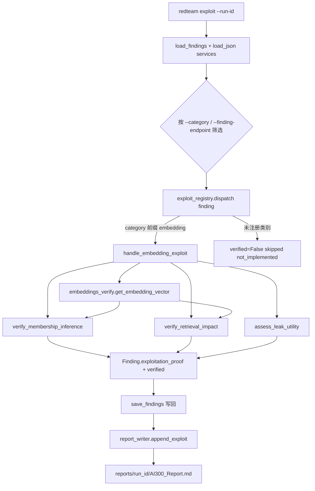

## 用户需求澄清

用户原主张「当前所有代码只是发现线索、没有攻击能力」已纠正：**代码具备攻击执行能力**（真实发送注入/越狱请求并用 LLM-as-Judge 评分），但 attack→exploit 的**影响验证闭环不足**——多数 Finding 仅证明漏洞类「可达」，未证明「实际影响发生」。嵌入攻击阶段（AI-300 Ch6）最典型，仅做存在性检测。

用户最终确认采用 **方案 A（独立 exploit 流水线）**，**全面完整实施**，契合 Enumerate→Attack→Exploit 分层的实战方法。否决方案 B（内嵌 `--verify`）：因其无法按 Finding 定向下钻、整阶段捆绑重跑、职责耦合。

## 产品概述

新增一条独立的「利用证明流水线」，将检测流水线（现状）产出的「线索型 Finding」升级为「携带利用证明的 Finding」，形成 Detect→Exploit 双阶段闭环。以嵌入阶段（Ch6）为完整参考实现，并预留通用分发框架供其他 Phase 后续接入。

## 核心特性

- **独立 exploit 命令**：`redteam exploit --run-id <id> [--category embedding_inversion] [--finding-endpoint <url>] [--target ...] [--api-key ...]`，按 `finding.category` 定向下钻单个线索，支持迭代试错。
- **通用分发注册表**：`exploit_registry` 按 category 前缀路由到对应验证器；未实现类别诚实标记 `verified=False` + `{skipped:"not_implemented"}`，严禁伪造。
- **嵌入证明三验证器**：余弦相似度成员/属性推断（替代原 `stdev<0.15` 启发式）、注入后检索前后 diff 影响闭环、泄露真实元数据效用提取。
- **Finding 承载证明**：新增 `exploitation_proof` 与 `verified` 字段，报告可渲染请求/响应日志、相似度分数、检索前后 diff。
- **零外部依赖**：仅 numpy + httpx + pydantic，保持 Native-Only 铁律。
- **向后兼容**：不改动现有 `run`/`run --phase` 与 embeddings_phase 检测逻辑，现有考试快照稳定。

## 技术栈选型

- 语言/运行时：Python >= 3.10（项目强制），类型提示 + Pydantic v2
- 网络层：httpx（复用现有 `verify=False` 风格与 `auth.to_header_dict()` 模式）
- 向量计算：numpy（余弦相似度，O(n·d) 可忽略开销，批量向量化）
- 数据模型：复用 `redteam/core/models.py` 的 `Finding` / `AIService` / `AuthContext`
- 持久化：复用 `redteam/core/store.py` 的 `load_findings` / `load_json` / `save_findings`
- 配置驱动：新增 `config/payloads/llm08/embedding_verify.yaml` 验证探针
- 约束：零外部框架依赖，严禁 Garak/PyRIT 运行时调用（Native-Only）；单模块 ≤500 行

## 实现方案

### 总体策略

新增一条与检测流水线解耦的独立利用流水线：读取 `reports/{run_id}/findings.json`，经 `exploit_registry` 按 `finding.category` 前缀分发到对应 handler（嵌入类别 → `handle_embedding_exploit`），handler 重新向目标端点发起验证性请求、执行影响证明，将升级后的 `exploitation_proof` + `verified` 写回 findings.json，并增量追加 Exploitation Report 段落。

### 关键技术决策

1. **相似度推断而非模型反演**：真实嵌入反演需训练解码模型（违反 R6）。采用教科书式余弦相似度成员/属性推断——对候选文本取嵌入 `e_c`，与已知成员基线 `{e_m}`、非成员基线 `{e_n}` 计算平均相似度，`delta = mean_sim(e_c, members) - mean_sim(e_c, non_members)`，量化置信度。纯 numpy 可复现、可解释，契合「证据完整」。
2. **检索前后 diff 闭环**：注入成功后向检索端点（`/v1/query`、`/api/search`、`/search`）发中性查询，对比注入前后 top-k 返回差异，差异命中注入指令即 `impact_verified=True`；检索端点不可达时诚实标记 `impact_unverified`，不伪造断言。
3. **模块拆分控行数**：`embeddings_attack.py` 已 509 行，将验证能力抽到新的 `embeddings_verify.py`（含 `get_embedding_vector` helper），避免超 500 行，且验证逻辑可独立测试。
4. **YAML 驱动验证探针**：成员基线、检索查询以 YAML 存于 `llm08/embedding_verify.yaml`，保留 Python fallback 常量（R3），不在代码硬编码目标文本。
5. **字段扩展非破坏性**：`Finding` 新增 `exploitation_proof: Optional[dict]=None` 与 `verified: bool=False`，默认值保证旧 findings.json 反序列化兼容。

### 性能与可靠性

- 相似度计算 O(n·d)（n≈5, d≈1536），开销可忽略；numpy 向量化避免 Python 循环。
- 检索验证仅触发 1~2 次额外 HTTP，受现有 `timeout` 约束，不放大爆炸半径。
- 全部外部调用 mock；numpy 用合成向量测试；禁止真实凭据/URL（R6、测试规范）。

## 实现注意事项

- 复用现有 `auth.to_header_dict()`、`store.load_findings/load_json/save_findings`、`inject` 命令「按 run_id 读 services 再执行」模式（cli.py line 887-1008）。
- 新增函数必须带 `manual` 参数（R3），docstring 注明 AI-300 Ch6（R1）。
- YAML 中文引号使用 Unicode `\u201c\u201d`，禁内层 ASCII `"`。
- 不改动 OWASP LLM08/LLM04 与 MITRE ATLAS 映射（R2），保持现有阶段顺序。
- CLI 变更 → 同步 `docs/COMMAND_REFERENCE.md`（Makefile 同步规则）。
- `main()` 已抑制 traceback，exploit 命令无需额外处理。

## 架构设计



现有检测流水线（`run`/`embeddings_phase`）完全不变；新增独立的 Exploit 链路，形成 Detect→Exploit 双阶段闭环。

## 目录结构

```
redteam/
├── core/
│   └── models.py                    # [MODIFY] Finding 增加 exploitation_proof: Optional[dict]=None 与 verified: bool=False；docstring 标注 Ch6 证据维度
├── attack/
│   └── embeddings_verify.py         # [NEW] 纯原生验证层：get_embedding_vector / verify_membership_inference /
│                                    #        verify_retrieval_impact / assess_leak_utility；numpy + httpx，
│                                    #        全函数带 manual 参数 + Python fallback 常量（R3），≤500 行
├── pipeline/
│   ├── exploit_registry.py          # [NEW] ExploitHandler 协议 + register(category_prefix, handler) +
│                                    #        dispatch(finding, services, auth)；未注册类别诚实 skip
│   ├── exploit_embeddings.py        # [NEW] handle_embedding_exploit(finding, services, auth)：匹配 endpoint
│                                    #        的 AIService，重取向量调三验证器，聚合写回 proof + verified
│   └── report_writer.py             # [MODIFY] 新增 append_exploit(phase_name, findings) 渲染 exploitation_proof
│                                    #        （请求/响应日志、相似度分数、检索前后 diff）→ 证据完整性 20%
└── cli.py                           # [MODIFY] 新增 @app.command() def exploit(...)：run_id 必填 + --category /
                                     #        --finding-endpoint / --target / --api-key / --header-file /
                                     #        --header-text / --force；复用 inject 读取模式
config/
└── payloads/
    └── llm08/
        └── embedding_verify.yaml    # [NEW] 验证探针：membership_baseline（已知成员/非成员样本）、
                                     #        retrieval_verify_query、leak_probe；含 Python fallback 源
tests/
├── test_embeddings_verify.py        # [NEW] 三验证器：正常/边界（空基线、检索端点缺失）/空输入；mock httpx+numpy
└── test_exploit_registry.py         # [NEW] dispatch 路由 / 未注册类别 / skip 行为
docs/
└── COMMAND_REFERENCE.md             # [MODIFY] 新增 exploit 命令条目（用法示例 + 执行命令）+ 变量参考
```

## 关键代码结构

```python
# redteam/core/models.py — Finding 扩展
class Finding(BaseModel):
    # ... 现有字段 ...
    exploitation_proof: Optional[dict] = None   # 结构化利用证明:
                                                # {method, evidence_log:[{request,response}],
                                                #  metrics:{similarity_delta,confidence},
                                                #  impact_verified:bool}
    verified: bool = False                      # 仅当实际证明影响/利用时为 True
```

```python
# redteam/attack/embeddings_verify.py — 验证层接口（仅签名）
def get_embedding_vector(
    service: AIService, text: str,
    auth: AuthContext | None = None, timeout: float = 10.0,
) -> list[float]: ...

def verify_membership_inference(
    service: AIService, candidate_text: str,
    member_baselines: list[str], nonmember_baselines: list[str],
    auth: AuthContext | None = None, manual: bool = False, timeout: float = 10.0,
) -> dict: ...   # {inferred, similarity_delta, confidence, proof_log}

def verify_retrieval_impact(
    service: AIService, injected_payload: str, retrieval_query: str,
    auth: AuthContext | None = None, manual: bool = False, timeout: float = 10.0,
) -> dict: ...   # {impact_verified, before_topk, after_topk, diff}

def assess_leak_utility(
    service: AIService,
    auth: AuthContext | None = None, manual: bool = False, timeout: float = 10.0,
) -> dict: ...   # {model, dims, tokenizer, utility_note}
```

## Agent Extensions

### SubAgent

- **code-explorer**
- Purpose: 在实施各步骤时深入读取 embeddings_attack.py、models.py 的 Finding 字段、report_writer.py 的 append_phase/append_recon 签名、store.py 持久化接口，确保新增代码与现有实现精确对接。
- Expected outcome: 产出准确的现有函数签名、Finding 字段清单与调用约定，避免接口不匹配导致的回归。