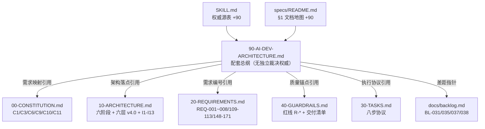

## User Requirements

基于 PyRIT 原生框架的企业 AI 应用红队测试项目，需要一份完整的 **AI 编程架构设计总纲文档**，确保后续 AI 编码代理遵循该框架实施代码，且代码质量达到 L5 专家生产标准。

## Product Overview

产出 `docs/specs/90-AI-DEV-ARCHITECTURE.md` 总纲文档 + AI 遵循机制接线。文档以用户的 5 条产品需求为契约主线，逐条映射到项目现有规约金字塔（宪法/蓝图/需求/任务/护栏）与 v4.0 六层目标架构，**只引用不复制**现有规则（宪法 C3 SSOT、文档纪律 D1–D7）。差距项只登记指针（backlog/REQ），不在本次实施代码。

## Core Features

- **需求①（侦察）→ 落点映射**：Burp .txt/URL 输入契约 → ①RECON 阶段 + 浅层/深度两级探测（MCP/GraphQL/关联端点探测队列、recon/adapters/、SurfaceGraph）；Embedding 按 REQ-110 裁决口径（黑盒不可测，仅外部工具形态）表述
- **需求②（武器化编排）→ 落点映射**：②ARM 阶段 + ComponentRegistry（config/components/*.yaml）按组件选择 seeds/converters/strike 策略；技术路由断裂差距指向 BL-031→REQ-151 PlaybookEngine
- **需求③（PyRIT 原生执行）→ 落点映射**：③STRIKE/④ESCALATE，C1 原生优先决策树 + 7C 组件速查 + PlaybookEngine（差距 BL-037 TargetAdapter 主链路接线为指针）
- **需求④（攻击进度呈现）→ 落点映射**：EventLog + utils/display + PyRIT 原生 output（I9/I12 不变量）
- **需求⑤（专项报告+证据，OffSec 合规）→ 落点映射**：⑤ASSESS/⑥REPORT + REQ-113 四段结构 + NFR-13 双口径 + 证据链红线（R-EVID-1）+ 组件级 report_section
- **AI 遵循机制接线**：文档进入 specs/README.md 索引（版本列同步）、SKILL.md 权威源表引用、门禁验证确保 AI 后续编码强制遵循
- **差距登记**：BL-031/035/037/038/024/025/027 等以指针形式进入文档差距章，不重复登记（D1）

## Tech Stack

- **文档**：Markdown（中文，对齐现有 specs 文风与表格规范）
- **验证工具链**：现有门禁（`python -m tools.guard`、`python -m tools.drift_detector --full`）、R-DOC-4 README 版本同步自动校验
- **纯文档任务**：不新增/修改任何 Python 代码、配置、依赖

## Implementation Approach

1. **定位**：90 文档定位为“配套总纲/overlay 层”——与 50-ROADMAP 同级（无独立裁决权威），其效力完全来自对 ①-⑤ 层规约的引用映射；文首显式声明效力边界，避免与 C3 冲突
2. **结构**：五章——① 产品契约（5 需求原文规范化）；② 需求→六阶段/六层架构落点映射表（每行引用 REQ/不变量/模块路径）；③ AI 编程遵循流程（宪法裁决序→规格先行→八步协议→门禁→L5 质量锚点 NFR 引用）；④ 已知差距与归宿登记（指针式，引用 backlog 编号）；⑤ 文档纪律自检清单
3. **纪律遵守**：无行号坐标（D2）、无正文版本史（D3）、不抄写组件/门禁清单（D1/D4）、引用路径全部实测存在（D5）、无占位符（D7）
4. **接线最小化**：README.md §1 表格加一行 + SKILL.md Quick Reference 权威源表加一行；版本号在 90 文件头声明 v1.0 并与 README 行同步（R-DOC-4 校验对象）
5. **性能/风险**：零代码变更，blast radius 仅限 docs/ + SKILL.md；唯一风险点为 drift_detector 对新增规约文件的反应（执行时实测确认，必要时按其告警口径修正）

## Architecture Design

文档自身位于规约金字塔配套层，引用关系如下：



## Directory Structure Summary

```
pyrit-mini/
├── docs/
│   └── specs/
│       ├── 90-AI-DEV-ARCHITECTURE.md  # [NEW] AI 编程架构设计总纲 v1.0。
│       │                              #   五章：产品契约（5 需求）/ 需求→架构落点映射 /
│       │                              #   AI 编程遵循流程 / 差距登记指针 / 纪律自检
│       └── README.md                  # [MODIFY] §1 文档地图表格新增 90 行
│                                      #   （层级/文件/版本 v1.0/职责/何时读），
│                                      #   满足 R-DOC-4 版本同步校验
└── .assistant_pyrit/
    └── skills/
        └── pyrit-strike-dev-rules/
            └── SKILL.md               # [MODIFY] Quick Reference 权威源表新增
                                         #   90 行；正文补一条"编码前先读 90 落点映射"引用
                                         #   （只引用不复制 90 内容，C3）
```

## Agent Extensions

### SubAgent

- **code-explorer**
- Purpose: 执行前核对接线细节——80-COMPONENT-ARCHITECTURE-RULES.md 与 40-GUARDRAILS.md 的章节结构（供 90 文档精确引用）、tools/drift_detector.py 对新增规约文件的校验逻辑（确认新增 90 是否需要登记/是否会误报）
- Expected outcome: 输出精确的章节引用锚点与 drift_detector 行为结论，避免 90 文档引用不存在的内容（D5）或触发误报