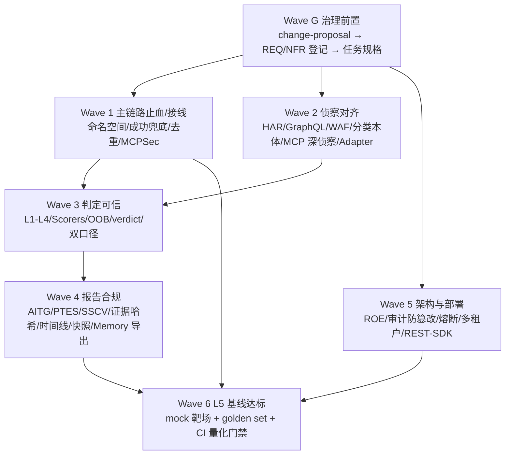

## 产品概述

对既有 `pyrit-mini`（基于 PyRIT 1.0 的 LLM/Agentic 红队测试框架）做一次"对照实况的差距诊断 + 分波次代码优化"。交付分两部分：

- **Part A 逐问作答与差距矩阵**：针对用户提出的六大区块问题（整体架构边界 / 输入与侦察 / 攻击编排 / 攻击执行 / 执行监控 / 报告与证据 / 横切关注点），逐条给出"现状—代码证据—差距—归属波次"。
- **Part B 可执行优化计划**：按"治理前置 → 主链路止血接线 → 侦察对齐 → 判定可信 → 报告合规 → 架构与部署 → L5 基线达标验证"的波次推进，最终把项目提升到"L5 专家 100%"。

## 核心功能

- **差距矩阵诊断**：逐条回答系统边界与部署模型、多租户隔离、PyRIT 集成深度、目标类型分类本体、授权与合规边界（ROE / 范围锁定 / 熔断 / 审计）；输入源规范化（URL / Burp .txt / HAR / 多请求 / Site Map）；Phase 1 前期侦察检测项；Phase 2 专项深侦察（MCP / RAG / Embedding / Agent）；决策引擎与 Seeds/Converters/Strike 映射；执行参数与 HITL；进度指标与 L1–L4 成功分层；报告标准对齐（OWASP AITG / OWASP LLM Top10 / MITRE ATLAS / PTES / AI-SSCV）与证据完整性；横切（自定义 PyRIT 组件、Seeds 库、错误处理、安全隔离）。
- **可执行优化计划**：以波次为单位、每波独立可验收可回滚；每波先补规格（change-proposal + REQ 登记）再编码；每波收尾跑门禁并验证端到端可跑与证据可复现。
- **验收锚点**：以项目内置 L5 基线（`config/defaults.yaml` 的 L5 参数 + `arm.converter_presets.l5_optimal`）为量化验收标准，而非主观评价。

## 视觉与交互效果

无界面变更，交付物为代码、规格文档与终端输出（沿用现有终端展示与 PyRIT 原生 output）。

## 一、技术栈选型

### 现有（保持不变，不新增运行时依赖）

- 运行时：Python ≥3.13；`pyrit==1.0.*`（以 library 方式 import，62 处引用）；PyYAML、httpx、python-dotenv、rich。
- 编排：asyncio 单事件循环 + `core/phases/` 六阶段；入口 `main.py` → `core/phases/executor.run_attack_pipeline`。
- 治理工具链：`tools/gate.py`（统一入口）、`tools/guard.py` / `tools/guard_extended.py`、`tools/architecture_validator.py`、`tools/drift_detector.py`、`tools/dataflow/`；CI 在**仓库根** `.github/workflows/spec-gate.yml`（working-directory: pyrit-mini）。

### 新增依赖策略（硬约束 NEG-4）

若确需新增库（如契约校验 / 指标 / 追踪 / HTTP 录放），**必须先经 change-proposal 批准**再写入 `pyproject.toml`；批准前一律用标准库实现（例：OOB 监听用 `http.server`，哈希用 `hashlib`，mock 靶场用 `http.server`）。不得直接引入。

## 二、实施方案（总体策略）

1. **治理先行**：所有"用户新增且未登记"的能力（HAR/GraphQL/WAF、分类本体、ROE 文件、L1–L4 分层、OOB 验真、证据哈希/时间线/快照、报告标准、多租户、REST/SDK、审计防篡改、熔断）先走 `docs/specs/templates/change-proposal.md` → 人工批准 → 在 `docs/specs/20-REQUIREMENTS.md` 登记 REQ/NFR → 生成任务规格，**批准前不编码**（宪法 C6）。
2. **复用优先**：复用既有骨架而非另立——`core/context.py`（唯一阶段间通道）、`core/events.py`（EventLog，产物唯一派生源）、`core/contracts/`（evidence/verdict/manifest/impact_chain/component）、`core/registry.py` + `config/components/*.yaml`（组件差异 SSOT）、`strike/common/budget.py`（预算）、`core/state_machine.py`（checkpoint）、`core/cancellation.py`（取消）。
3. **PyRIT 原生优先**：任何攻击执行最终经 `pyrit.executor.attack.*` 原生类完成；自研仅限 PyRIT 域外（协议/Glue/Output）。
4. **薄适配器接线**：对形态各异的既有攻击模块，用适配器注册进统一调度，不重写模块内部，降低 blast radius。
5. **先契约最小集，再批量接线**：避免边接线边定契约产生脏代码。

### 关键技术决策与理由

- **修命名空间，不新建攻击类**：`strike/common/dispatcher.py::STRATEGY_MAP` 与 `strike/common/progressive_strike.py::STRATEGY_CLASS_MAP` 指向 0.x 遗留 `pyrit.attacks.*`，import 必失败并静默回退到 native executor。统一改为 PyRIT 1.0 的 `pyrit.executor.attack.*` 真实路径，不新增第二套攻击实现（C3）。
- **接线与预算同步落地**：孤儿模块（`recon/mcp/*`、`recon/web/*`、`recon/session/*`、`recon/orchestrator.py`、`recon/health_probe.py`、以及无生产调用点的 `strike/*` 模块）一次性全部接入会导致攻击规模爆炸；必须同批落地 `BudgetController` 三维约束（数量 / 时间 / token），超限按 `ComponentSpec.asr_prior` 降序裁剪并记录裁剪原因（否则报告无法解释"为何某攻击面未执行"）。
- **桩按 R-H1 处理**：`recon/api/openapi_capture.py`、`recon/rag/kb_enumerator.py`、`recon/rag/embedding_scan.py`、`recon/embedding/similarity_probe.py`、`recon/model/capability_detector.py` 返回硬编码数据；要么接真、要么摘除并登记 backlog，禁止保留 stub 编排状态。
- **判定四态口径**：沿用 ADR-008，外传成立必须 OOB 回执（canary + 标准库监听），副作用成立必须二次独立请求确认；被降级者不得计入 `confirmed_asr`，报告须注明口径收紧而非能力退化。

### 性能与可靠性要点（基于现有实现模式）

- `assess/score_pipeline.py` 的 judge 并发此前无界（gather 全部 judge 请求）→ 用已存在的信号量与 `defaults.yaml::judge_max_concurrency` 约束，避免 429 静默 failure。
- `assess/judge_manager.py` 每响应约 250 次子串扫描 → 预编译为多分支正则单次匹配。
- `assess/component_router.py` 每 result 遍历 6×~10 条正则 → 按 component 预分组，避免全量匹配。
- `core/phases/executor.py::_get_result_outcome` 的 fallback（有 `converted_value` 即 success）与真实评分口径不一致 → 统一为 `assess.asr_stats._get_outcome` 单一 SSOT。
- 双源冲突：`defaults.yaml::max_concurrency: 5` vs 运行时 `core.context.get_effective_concurrency` clamp [1,3]，在 L5 基线达标波次统一。

## 三、Part A：逐问作答与差距矩阵（事实依据，禁止行号坐标，均以 `模块.符号` 引用）

### 一、整体架构层面

| 问题 | 现状 | 代码证据 | 差距 | 波次 |
| --- | --- | --- | --- | --- |
| 部署模型（CLI/Web/SDK） | CLI-only，单进程 | `main.py`、`pyproject.toml [project.scripts]` | 无 REST/Web UI/SDK/Docker | Wave 5 |
| PyRIT 集成深度 | 作为 library（`import pyrit`，共享 Memory 与 Scorer） | 62 处引用；`core/initializer_registry.py` | 无"独立进程/API 解耦"形态（本身合理，需文档化选型） | Wave 5 |
| 多租户隔离 | 仅 Memory labels 级作用域 | `core/phases/_helpers._setup_memory_labels`、`--memory-labels` | 无操作员/并行会话隔离；并发 clamp≤3 | Wave 5 |
| 目标类型分类本体 | 有组件注册表与多信号分类，但为单值 `component_type` | `core/registry.py`、`config/components/*.yaml`、`core/component_classifier.py` | **无四维 Taxonomy schema**（架构模式/协议/模态/认证）；单值属性须迁多标签（IC-1） | Wave 2（REQ-150） |
| 授权与合规边界 | 启动期白名单强制 + 运行期决策复核 | `core/context.enforce_authorized_scope`、`strike/common/decision_safety.py`、`defaults.yaml::authorized_targets` | **无 ROE 授权文件机制** | Wave 5 |
| 范围锁定 | 白名单 + 子域匹配 | `core/context.is_host_authorized` | 空名单时仅 WARNING，不阻断 | Wave 5 |
| 熔断机制 | 字段已声明但无消费者 | `core/context._circuit_breaker_states`（stub） | 无熔断；无 5xx 客户端重试 | Wave 5 |
| 审计日志 | EventLog JSONL append+flush，含 run_id | `core/events.py`、`ctx.orchestration_log` | 无哈希链/HMAC 防篡改；无 operator/who 身份 | Wave 5 |


### 模块1：输入与侦察

| 问题 | 现状 | 代码证据 | 差距 | 波次 |
| --- | --- | --- | --- | --- |
| URL 输入规范化 | 裸 URL 仅作 OpenAI 兼容端点/LiteLLM/Playwright | `recon/_target_router_helpers` | 无通用 URL 爬取与关联端点自动发现 | Wave 2 |
| 认证信息传入 | 保留原始头 + 认证类型/JWT/tenant 检测 | `recon/burp_parser`、`recon/api/auth_detector.py` | 基本满足 | — |
| Burp .txt 解析 | 单请求+响应解析 | `recon/burp_parser.parse_burp_request` | 无单文件多请求序列、无 HAR、无 Site Map/Postman 导入、无时序保留 | Wave 2 |
| 端点发现 / OpenAPI | 真实实现（13 路径 httpx） | `recon/api/openapi_discoverer.py` | `recon/api/openapi_capture.py` 为桩 | Wave 2 |
| GraphQL introspection | 0 处 | — | 完全缺失 | Wave 2 |
| 模型指纹 | Provider/版本多路探测 | `recon/capability_detector._detect_model_family`、`recon/capability_probe.probe_model_family_via_api` | `recon/model/capability_detector.py` 为桩 | Wave 2 |
| 架构识别 | 多启发式（app_type/内容分类/组件分类） | `recon/fingerprint.py`、`recon/api/endpoint_sorter.py` | 重复 `TargetFingerprint` 类冲突 | Wave 1 |
| 安全防护探测 | 内容/拒绝型 guardrail 3 档灰度 | `recon/guardrail_detector.detect_guardrail` | **无 WAF 检测；主链路无限流探测** | Wave 2 |
| MCP 专项侦察 | `recon/mcp/*` 6 模块齐全但**未接线**；实际走 MCPSec null bridge | `recon/mcp/*`、`strike/mcp/orchestrator.get_shared_bridge` | tools/resources/prompts/inputSchema/风险扫描未生效 | Wave 2 |
| RAG 专项侦察 | 管道/元数据/typo 真实接线 | `recon/rag/pipeline_probe.py` 等 | KB 枚举与 embedding 维度为桩 | Wave 2 |
| Embedding 专项 | 真实向量探测存在但仅供孤儿 orchestrator | `recon/embedding/vector_probe.py` | `similarity_probe` 桩；按 REQ-110 裁决黑盒不可测，仅域外工具形态 | Wave 2（登记口径） |
| Agent/Multi-Agent 专项 | A2A 发现/拓扑/防御/攻击计划完整接线 | `recon/a2a/*`、`ctx.a2a_*` | 部分模块未接线；trust 分析有 tuple 类型缺陷 | Wave 2 |


### 模块2：攻击策略编排

| 问题 | 现状 | 代码证据 | 差距 | 波次 |
| --- | --- | --- | --- | --- |
| 决策引擎 | 规则式（UCB1 + 先验 + 剪枝 + 4 层 converter 优先级） | `arm/seed_ranking`、`arm/converter_selector.py` | 无统一 `determine_*_strategy` 框架与 `ctx.decision_log` | Wave 3 |
| Seeds 库组织 | 按 component 目录 + Tier/OWASP/attack_vector 元数据 | `data/seeds/**`、`data/seeds/README.md` | 无"目标类型×风险类别"显式索引 | Wave 3 |
| Converters 选择 | 4 层规则优先级；**无自定义 Converter 类** | `arm/converter_selector.py` | `converter_presets.build_converter_map` 入参被忽略；`l5_optimal_for_model == l5_optimal`；领域专用 Converter 缺失 | Wave 3 |
| Strike ↔ Orchestrator 映射 | 有 `STRATEGY_MAP` + `_strategies.yaml` | `strike/common/dispatcher.py`、`strike/_strategies.yaml` | **命名空间失效**（`pyrit.attacks.*`）；GCG 仅字符串未实现 | Wave 1 |
| 专项映射表 | 渐进式策略表存在 | `strike/common/progressive_strike.py` | 无"目标×风险→seeds/converters/strike"矩阵 | Wave 3 |
| Objective/Scorer 判定 | 级联 T0→J1→J2(+J3) | `assess/score_pipeline.py`、`assess/adaptive_dual_judge.py` | 缺 L3/L4 语义 scorer（工具执行/检索投毒） | Wave 3 |
| 自适应策略调整 | 有 ASR 反馈闭环与 EMA | `assess/asr_manager.save_asr_history` | 无 converter 级失败降权/自动切换 | Wave 3 |


### 模块3：攻击执行

| 问题 | 现状 | 代码证据 | 差距 | 波次 |
| --- | --- | --- | --- | --- |
| 并发/重试/超时 | 均存在并配置化 | `core.context.get_effective_concurrency`、`strike/common/adaptive_executor.py`、`defaults.yaml` | `max_concurrency` 双源冲突 | Wave 6 |
| Memory 持久化 | 每 endpoint 独立 SQLite | `core/config.setup_environment` | 无跨 campaign 共享与导出 | Wave 3/4 |
| 目标适配 | 仅 `RateLimitedTarget` | `recon/target_wrapper.py` | **无 MCPTarget/RAGTarget/A2ATarget**（REQ-149） | Wave 2/3 |
| HITL 动态干预 | 仅协作取消 + 事后 checkpoint | `core/cancellation.py`、`core/state_machine.py` | 无暂停/手动注入/审批钩子 | Wave 3/5 |


### 模块4：执行监控

| 问题 | 现状 | 代码证据 | 差距 | 波次 |
| --- | --- | --- | --- | --- |
| 进度指标 | 终极端点/ASR/联合 ASR | `utils/display.py`、`assess/asr_manager.build_joint_summary` | 无实时"总体进度/资源消耗/策略排名"面板 | Wave 3 |
| L1–L4 分层 | 二值 success/failure(+undecided) | `assess/asr_stats._get_outcome` | **无 L1–L4**；无 ToolExecutionScorer/RetrievalPoisoningScorer | Wave 3 |
| 报告双口径 | 仅 `reported_asr` | `defaults.yaml::target_asr` | `confirmed_asr` 分列待实施（NFR-13） | Wave 3 |


### 模块5：报告与证据

| 问题 | 现状 | 代码证据 | 差距 | 波次 |
| --- | --- | --- | --- | --- |
| OWASP LLM/Web/ASI + MITRE ATLAS + CVSS | 存在 | `report/owasp_constants.py`、`report/owasp_mapping.py` | — | — |
| OWASP AITG / PTES / AI-SSCV | 0 处 / 仅注释 / 0 处 | — | 全部缺失 | Wave 4 |
| 专项报告模板 | 6 类组件模板（按主导组件仅渲染一个） | `report/component_reports.py` | 无 Embedding 模板；`ev.response` 死分支 | Wave 4 |
| 证据不可否认性 | 内容/ID 哈希（含 SHA-1） | `core/contracts/evidence.py`、`report/evidence.py` | 无证据打包 SHA-256；无 Kill Chain 时间线；无环境快照文件；**无 PyRIT Memory 导出**；无 raw HTTP 入证 | Wave 4 |


### 横切关注点

| 问题 | 现状 | 代码证据 | 差距 | 波次 |
| --- | --- | --- | --- | --- |
| 自定义 PyRIT 组件 | 仅 `RateLimitedTarget` | `recon/target_wrapper.py` | MCPTarget/RAGTarget、领域 Converter、ToolExecutionScorer/RetrievalPoisoningScorer、MCPAttackOrchestrator 缺失 | Wave 2/3 |
| 错误/边界处理 | 有 ConnectionError 终止策略；后台探测假设字段存在 | `core/phases/executor.py`、`recon/_target_router_helpers._run_background_probes` | 无 5xx 重试；部分静默 `except` 需升级可观测 | Wave 1/5 |
| 安全与隔离 | 有 payload 生成器与 stealth 时序 | `strike/injection/stealth_exec.py` | 无证据加密存储、无网络隔离断言 | Wave 5 |


## 四、Part B：分波次架构



**Wave G（治理前置）**：批量起草提案并登记 REQ-160+/NFR-17+/红线；为 REQ-148~158 未落地波次补任务规格。产出为规格文档，不落码。
**Wave 1（止血/接线）**：修 `strike/common/dispatcher.py::STRATEGY_MAP` 与 `strike/common/progressive_strike.py::STRATEGY_CLASS_MAP` 命名空间；修 `core/phases/executor.py::_get_result_outcome` 兜底；消除 `recon/fingerprint.py` 重复 `TargetFingerprint`；建 `strike/registry.py` + `config/attack_surface_matrix.yaml`；MCPSec 空桥接线或按 R-H1 摘除；孤儿模块按矩阵接线并加预算。
**Wave 2（侦察对齐）**：HAR/多请求/Site Map 输入、裸 URL 爬取、GraphQL introspection、WAF/限流探测；桩改真或摘除；MCP 专项侦察接线；`recon/adapters/*` + `MCPTarget/RAGTarget`（REQ-149）。
**Wave 3（判定可信）**：L1–L4 分层、`assess/component_scorers` → PyRIT Scorer 化（ToolExecution/RetrievalPoisoning）、OOB 验真 + 二次确认、`assess/impact/*`、`assess/persistence`（verdict + ScoreRunManifest）、切自反馈、报告双口径。
**Wave 4（报告合规）**：AITG 分层 + PTES 阶段 + AI-SSCV；证据 SHA-256 打包哈希 + Kill Chain 时间线 + 环境快照 + PyRIT Memory 导出 + raw HTTP 入证；修 `report/component_reports.py` 死分支、补 Embedding 模板、消除 `report/_poc_templates.py` 与 `poc_generator.py` 模板双份。
**Wave 5（架构与部署）**：ROE 文件启动强制、审计哈希链 + operator 身份、熔断接线 + 5xx 重试、多租户/并行会话隔离、REST/SDK/Docker（按需，先提案）。
**Wave 6（L5 基线达标）**：`targets/mock/` 5 类靶标（REQ-156）+ golden set；逐项校验 `defaults.yaml` L5 参数有真实消费者且语义一致；CI 量化门禁（FPR/FNR/κ 阈值）。

## 五、实施注意事项（防回归）

- **文档纪律**：所有引用用 `模块.符号`，禁止行号坐标（D2）；不手工抄写动态清单（D4）；新能力进 REQ 登记而非文档正文（D1/D6）。
- **不变量**：阶段间只经 `ctx` + EventLog（I12）；副作用步必须声明 cleanup（I13）；ASR 目标锚点只读 `defaults.yaml::target_asr`（I11）。
- **负需求**：不在攻击端加内容过滤/安全降级（NEG-2）；不新增绕过 ctx 的数据通道（NEG-3）；不引入未提案依赖（NEG-4）；不改 guard 检查器掩盖违规（NEG-5）；不下调 L5 基线（NEG-6）。
- **文件规模**：单文件 ≤850 行（R-SIZE），接线优先用适配器。
- **工作区现状**：当前有未提交改动（`core/config.py`、`docs/specs/{20,40,55,README}.md`、`tools/guard_extended.py`、`tools/release_audit.py`、`.assistant_pyrit/skills/...SKILL.md`）与未跟踪 `_check_help.py`；方案不得假设干净工作区，改动前先确认基线。
- **每波收尾**：更新 specs（README §1 版本表、`10-ARCHITECTURE` 4.4 ctx 字段总表、`20` 追踪表、`40` 登记簿、`55` 缺口）；跑六步门禁；`python main.py --dry-run --max-seeds 1`；L0–L4 变更过跨模型审查（C14）。

## 六、目录结构（新增/修改）

```
pyrit-mini/
├── docs/specs/
│   ├── plans/                                   # [NEW] 各波次 change-proposal 与执行计划
│   ├── 10-ARCHITECTURE.md                       # [MODIFY] 4.4 ctx 字段总表登记新字段
│   ├── 20-REQUIREMENTS.md                       # [MODIFY] 登记 REQ-160+/NFR-17+ 并去重自检
│   ├── 40-GUARDRAILS.md                         # [MODIFY] 登记新红线/门禁
│   └── 55-ATTACK-GAP-CLOSURE.md                 # [MODIFY] 新攻击模块缺口登记
├── config/
│   ├── attack_surface_matrix.yaml               # [NEW] 模块启用矩阵（id/entry/requires/enabled_by/priority/owasp/risk）
│   └── defaults.yaml                            # [MODIFY] 消除 max_concurrency 双源冲突；新增参数须提案（NEG-6）
├── core/
│   ├── context.py                               # [MODIFY] 新 ctx 字段（taxonomy/l1-l4/impact/oob/hitl）
│   ├── phases/executor.py                       # [MODIFY] 统一 _get_result_outcome 口径
│   └── contracts/                               # [MODIFY/NEW] taxonomy.py / l1_l4.py / oob.py 契约
├── recon/
│   ├── burp_parser.py                           # [MODIFY] 多请求/HAR/Site Map 输入
│   ├── adapters/{base,http,sse,jsonrpc,multipart}.py  # [NEW] TargetAdapter（REQ-149）
│   ├── surface/{graph,builder,legacy}.py        # [NEW] SurfaceGraph（REQ-150）
│   ├── graphql_probe.py                         # [NEW] GraphQL introspection
│   ├── waf_detector.py                          # [NEW] WAF/限流指纹
│   └── mcp/{schema_extractor,tool_inventory,...} # [MODIFY] 接线进主链路
├── arm/
│   ├── decision_matrix.py                       # [NEW] 目标类型×风险类别→seeds/converters/strike
│   └── converter_presets.py                     # [MODIFY] 消费 chain_names/overrides/seeds/fingerprint
├── strike/
│   ├── registry.py                              # [NEW] AttackModule 协议 + 注册表
│   ├── surface_selector.py                      # [NEW] 能力探测→启用模块集合
│   ├── targets/{mcp,rag,a2a}.py                 # [NEW] MCPTarget/RAGTarget/A2ATarget
│   ├── common/dispatcher.py                     # [MODIFY] 修 pyrit.executor.attack.* 命名空间
│   ├── common/progressive_strike.py             # [MODIFY] 修 STRATEGY_CLASS_MAP；补 PAIR/GCG
│   └── playbook/{engine,model,registry,state}.py + playbooks/*.yaml  # [NEW] REQ-151（迁移 4 条硬编码链）
├── assess/
│   ├── component_scorers.py                     # [MODIFY] 升级为 PyRIT Scorer 子类
│   ├── impact/{model,exfil,verdict,canary}.py   # [NEW] ImpactChain + ExfilChannel（REQ-152）
│   └── persistence.py                           # [NEW] verdict 持久化 + ScoreRunManifest
├── report/
│   ├── standards/{aitg,ptes,sscv}.py            # [NEW] 标准映射
│   ├── evidence.py                              # [MODIFY] SHA-256 打包哈希 + Kill Chain 时间线
│   ├── memory_export.py                         # [NEW] PyRIT Memory 导出
│   └── component_reports.py                     # [MODIFY] 修 ev.response 死分支 + Embedding 模板
├── tools/oob_listener.py                        # [NEW] 标准库 OOB 回执（REQ-152）
├── targets/mock/                                # [NEW] 5 类 mock 靶标（REQ-156，标准库 http.server）
├── tests/
│   ├── unit/test_import_graph.py                # [MODIFY] 扩展覆盖新模块
│   ├── golden/golden_set.yaml                   # [NEW] 人工标注集（FPR/FNR/κ）
│   └── e2e/test_full_pipeline.py                # [NEW] mock 靶场端到端
└── Dockerfile                                   # [NEW] 可复现交付（须提案）
```

## 七、关键代码结构（接口级）

```python
# strike/registry.py —— 统一接线的最小共同接口
from typing import Protocol, runtime_checkable

@runtime_checkable
class AttackModule(Protocol):
    id: str                                  # 稳定标识，如 "a2a.card_spoofer"
    surface: str                             # a2a|mcp|rag|memory|session|web|evasion|model
    requires: frozenset[str]                 # 依赖的 target capability，全部命中才启用
    enabled_by: str                          # "auto" | "opt_in"
    priority: int                            # 预算裁剪保留顺序
    owasp: tuple[str, ...]                   # 报告映射

    async def execute(self, ctx, target, budget) -> list[dict]: ...
```

```python
# recon/adapters/base.py —— 协议/认证态/会话态统一归一（REQ-149）
class TargetAdapter(Protocol):
    async def send(self, request: dict) -> dict: ...   # 编排层不可见协议差异
    async def close(self) -> None: ...                 # I13：副作用步必须可清理
```

```
# config/attack_surface_matrix.yaml —— 接线与预算的数据驱动核心
modules:
  - id: mcp.malicious_server
    entry: strike.mcp.malicious_server:serve_rogue
    surface: mcp
    requires: [mcp_protocol]
    enabled_by: opt_in
    priority: 20
    owasp: [ASI02, ASI05]
    risk: high            # high 模块必须显式 --enable-<id>
```

## Agent Extensions

### SubAgent

- **code-explorer**
- 用途：在 Wave G 治理前置阶段核实"用户新增能力"的精确代码落点与既有缺口，产出可支撑 change-proposal / REQ 登记的"缺口→模块.符号→归属波次"清单；在 Wave 1 接线阶段定位孤儿模块的入口函数签名、返回值形态与依赖的 ctx 字段，产出适配器注册表所需映射。
- 预期产出：按波次分组的"缺口→代码证据→接线点"映射表，直接用于提案与任务规格。

### Skill

- **lsp-code-analysis**
- 用途：在 Wave 1 攻击类命名空间修复与算法去重收敛阶段做符号级导航——`find references` / `call hierarchy` 精确确认 `STRATEGY_MAP`、`STRATEGY_CLASS_MAP`、各重复实现与 `_get_result_outcome`/`_get_outcome` 的全部引用闭包，确保替换与删除不遗漏 re-export 与惰性分发路径。
- 预期产出：每类符号的完整引用闭包与可安全替换/删除的文件清单。