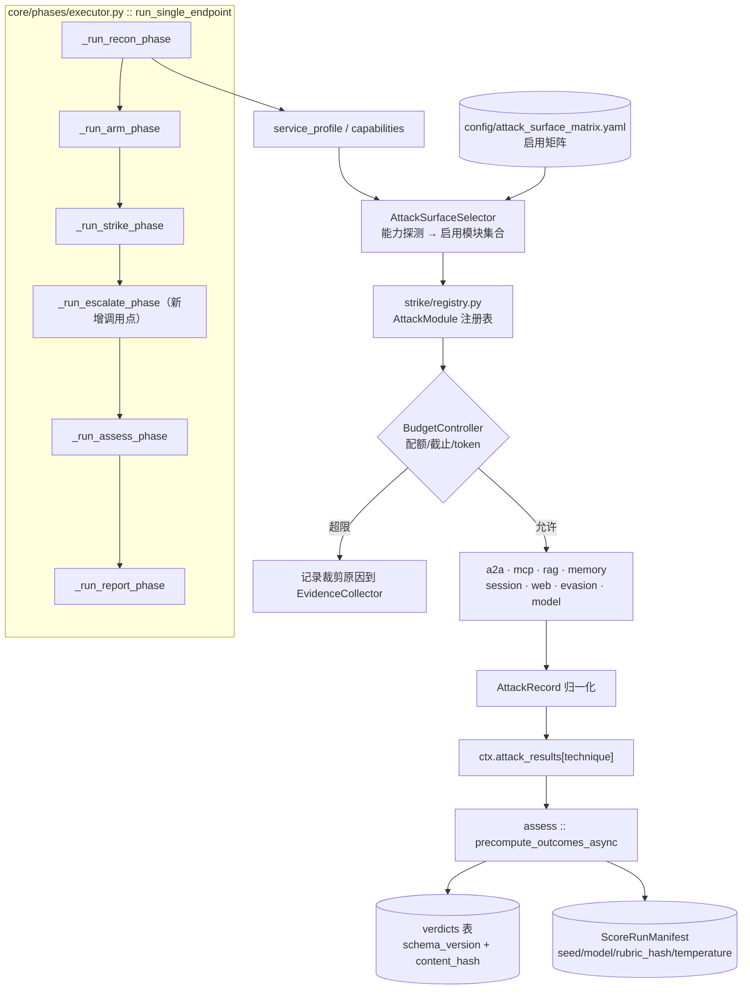

## 产品概况

对 `d:/文档/GitHub/osai/pyrit-mini`（PyRIT 1.0 集成式 LLM/Agentic 红队框架）实施 **L5 生产标准优化**。当前结论：本项目是「L4 的评测与取证外壳」+「L1.5 的攻击执行内核」，且两者连接处断裂——评测链路（T0→J1→J2 双 Judge、Wilson CI、Cohen's Kappa、SARIF、OWASP/CVSS/MITRE 映射）代码完整且是真实资产；但攻击层 67 个模块中仅 16 个有生产可达调用点，主链路实际只跑 2 个算法，<｜hy_place▁holder▁no▁813｜> `--burp` 默认命令在 RECON 阶段即崩溃且退出码为 0。

本次优化的目标是**消除「宣称能力」与「可执行能力」之间的 4:1 落差**，并把「L5」从主观评价转换为 CI 可执行的量化门禁。

## 用户已确认的范围与方向（四项主线全选）

1. **先「能打」**：补齐攻击能力接线——escalate 接线、Crescendo/TAP/PAIR 收敛并接线、A2A/MCP/Memory/Web/Evasion 攻击面全部接入主链路
2. **先「能跑」**：修 P0、导入连通性、契约/配置地基
3. **先「可信」**：评分正确性与可复现性
4. **全量 6 Wave 按序推进**，一次规划到底、分批落地

## 核心功能需求

### F1 主链路止血

- 修复 `core/phases/recon.py:85-107` 的必崩 `NameError`（`rag_profile` 未绑定 + 不存在的 `recon.rag_pipeline_probe` 模块 + 缺失的 `--rag-probe` CLI 参数）
- 修复 `core/phases/_helpers.py:14-23`（`_resolve_burp_list` 正常路径返回 `None`）与 `:183-195`（`_get_arm_target_type` 恒返回 `unknown` 的死代码）
- 修复 8 条重构后遗留的扁平路径 import（`main.py:263`、`core/phases/strike.py:79/95/236/397/660/711`、`core/phases/arm.py:48`）及 recon 侧陈旧路径
- 修复 `pyproject.toml:25` 失效打包入口与 `main.py:127` 不存在的 watcher

### F2 统一攻击面调度器（用户选择「全部接线」）

- 设计 `AttackModule` 协议 + `strike/registry.py` 注册表 + `config/attack_surface_matrix.yaml` 启用矩阵
- 把 51 个零生产调用点模块（a2a 5/5、memory 3/3、evasion 3/3、web 5/5、mcp 5/5、session 12/14、rag 5/6、model 4/7）按能力探测结果动态接入主链路
- 消除「标签 ≠ 算法」：`technique_picker` 选出的 12 个技术必须映射到真实 executor（`strike/common/executor.py` 当前从不读 `ctx.techniques`）
- 把 `_run_escalate_phase`（`core/phases/strike.py:683`，当前零调用点）真正接入 `run_single_endpoint`

### F3 重复实现收敛（用户选择「单一实现 + 配置化参数」）

- TAP 4 套 → 1 套、PAIR 2 套 → 1 套、Crescendo 3 套 → 1 套、`_is_success` 3 份 → 1 份
- 所有算法参数外置到 YAML；统一采用 PyRIT 1.0 的 `pyrit.executor.attack.*` 命名空间，废弃 `pyrit.attacks.*`

### F4 评分可信性

- 修复 `_HIGH_CONFIDENCE_PATTERNS` 含拒绝词导致的误判成功，以及早返路径伪造 `judge2_successes`/`agreements`
- 切断 ASR→阈值→ASR 自反馈回路；统一三套并行的成功口径
- 判定结果持久化（带 `schema_version` 与内容哈希）+ 可复现 `ScoreRunManifest`（seed、judge 模型、rubric 哈希、温度）

### F5 量化验证基线（用户选择「mock target 录放 + golden set」）

- 内置 mock HTTP target，实现 CI 可跑的真端到端
- 建立 300–500 条人工标注 golden set，用于校准 Judge 的 FPR/FNR/κ

### F6 交付硬ening

- 修 `report/generator.py:270-287` 三份核心 Markdown 永不生成的缺陷；HTML 转义与模板化
- token/cost 账本与 Prometheus/OpenTelemetry 观测
- lock 文件、CI、mypy、覆盖率门禁、SECURITY.md、运行时授权边界

## 边界约束

- 本次任务仅产出方案，**不修改任何文件**
- 当前工作区有大量已修改未暂存文件，方案不得假设干净工作区
- 保留 `tools/guard*.py` 仅做架构约束（分层/宪法红线）；格式、安全、复杂度交给成熟工具

## 技术栈选型

### 现有（保持不变）

- 运行时：Python >= 3.13，`pyrit==1.0.*`（锁死），PyYAML、httpx、python-dotenv、jinja2、rich
- 编排：asyncio 单事件循环 + `core/phases/` 六阶段
- 治理：`tools/guard.py` / `guard_extended.py` / `drift_detector.py` / `tools/dataflow/`

### 新增（按用途分组，均为成熟方案）

| 用途 | 选型 | 理由 |
| --- | --- | --- |
| 契约层 | **Pydantic v2** | 替代 `dict[str, Any]`；自带 JSON Schema 与 `schema_version` 承载 |
| 结构化日志 | **structlog** | 与 stdlib logging 兼容，输出 JSON，便于注入 trace_id |
| 指标 | **prometheus-client** | ASR / 时延 / 纟错率 / token / cost |
| 链路追踪 | **OpenTelemetry SDK** | 六阶段 span + LLM 调用 span |
| 测试加固 | **pytest-cov、pytest-benchmark、respx**（HTTP 录放） | 覆盖率门禁 + 性能回归 + 确定性 e2e |
| 依赖锁定 | **uv**（生成 `uv.lock`） | 可复现构建；同时补齐未声明的 `aiohttp` |
| 静态检查 | **ruff**（扩规则集）+ **mypy**（渐进）+ **import-linter** | 替换自研检查器的大部分职责 |
| 攻击预算 | 自研 `BudgetController`（无成熟轮子） | 接线后必须限制攻击规模爆炸 |


### 关键决策

- **PyRIT 命名空间**：一律采用 `pyrit.executor.attack.*`；`strike/common/dispatcher.py:53-62` 指向的 `pyrit.attacks.*` 属 0.x 遗留，随去重一并废弃。
- **不引入 Narwhals/Polars 等重型依赖**：数据规模（千级 seed）用标准库足够。

---

## 实施方案

### 总体策略：先契约的最小可行集 → 再批量接线 → 最后加固

用户把「能打」排在第一优先，但 51 个模块若先接线后定契约会产生大量脏代码。**折中方案**：Wave 1 只定义**最小契约**（`AttackModule` 协议 + `AttackRecord` 结果结构 + 注册表 + 启用矩阵），**不**做完整 Pydantic 迁移（后者推迟到 Wave 5 的交付硬ening），以此解除对 Wave 2 接线的阻塞。

### 接线后的核心风险与缓解（用户明确选择的高风险路径）

51 个模块全部接入会导致攻击规模爆炸。必须在 Wave 2 **同时**落地预算控制：

```python
class BudgetController:
    """接线后的必需安全阀，防止攻击规模与成本失控。"""
    max_total_attacks: int      # 全局攻击次数上限
    per_surface_quota: dict[str, int]   # 每个攻击面的配额
    wall_clock_deadline: timedelta      # 全局截止时间
    token_budget: int                   # LLM token 预算（含 judge）
    # 任一超限时按 priority 降序裁剪，且必须在 EvidenceCollector 中记录裁剪原因
```

三个维度同时控制：**数量**（max_total_attacks / per_surface_quota）、**时间**（deadline + CancellationToken）、**成本**（token_budget）。

### 复杂度与性能考量

- 能力探测驱动的模块筛选：`O(模块数 × 能力数)`，51 × ~10 = 500 次判定，可忽略
- `score_pipeline.py:364` 当前无界并发（Gather 全部 N 个 judge 请求）→ 429 → 静默 failure。修复后用已创建但未使用的 `asyncio.Semaphore`（`:237`）包裹，并发 = `rpm // 30`
- `judge_manager.py` 每条响应做约 250 次子串扫描 → 预编译 `re` 为单位正则集合，改为单次多分支匹配
- `component_router.py:150` 每 result 遍历 6×~10 条正则 → 按 `component_type` 预分组，避免全量匹配

### 避免技术债

- 复用现有 `utils/attack_utils.py:33` 作为 `_is_success` 单一 SSOT，删除另两份（其 `bool(score_val)` vs `score_val > 0` 的语义差异必须在去重时统一为 `> 0`）
- 复用 `config/defaults.yaml` 作为配置 SSOT，消除 `max_concurrency` 5 vs 3 的双源冲突
- 不做大范围重写：接线通过适配器（Adapter）包住现有模块入口，而非修改模块内部实现

---

## 架构设计

### 目标架构（接线后）



### 攻击模块统一契约

```python
# strike/registry.py —— 接线的最小共同接口
@runtime_checkable
class AttackModule(Protocol):
    id: str                                  # 稳定标识，如 "a2a.card_spoofer"
    surface: AttackSurface                   # Enum: A2A|MCP|RAG|MEMORY|SESSION|WEB|EVASION|MODEL
    requires: frozenset[str]                 # 依赖的 target capability，全部命中才启用
    enabled_by: Literal["auto", "opt_in"]    # auto:能力满足即用; opt_in:需显式 flag
    priority: int                            # 预算裁剪时的保留顺序
    owasp: tuple[str, ...]                   # 用于报告映射

    async def execute(
        self, ctx: RunContext, target: PromptTarget, budget: BudgetController
    ) -> list[AttackRecord]: ...
```

现有各模块形态不一（`async def execute/attack/run/_run` 混杂），通过**薄适配器**注册，不改动模块内部：

```python
# strike/registry.py
def register(module_id: str, *, surface, requires, enabled_by, priority, owasp, entry):
    """把任意签名的既有函数适配为 AttackModule。"""
```

### 评分正确性改造要点

- `_HIGH_CONFIDENCE_PATTERNS` 拆分为中性 `_CONFIDENCE_PATTERNS` + 独立 `_REFUSAL_PATTERNS`；早返要求 `j1 is True 且 rationale 无拒绝语义`
- 早返路径**不再**递增 `judge2_successes` / `agreements`
- 自适应阈值不再消费被自身影响的 EMA 历史：改为固定 holdout + 离线校准
- 成功口径统一为 `_get_outcome`（`assess/asr_stats.py:211`）；删除 `core/phases/executor.py:155-157` 的「有 converted_value 即 success」兜底

---

## 目录结构

```
project-root/
├── core/
│   ├── phases/
│   │   ├── recon.py                # [MODIFY] 修 :85-107 NameError；修正 4 条陈旧 import；`rag_profile = None` 预初始化
│   │   ├── strike.py               # [MODIFY] 修 8 条坏 import；接入贪钱 crescent AMD escalate 调用点；改为统一注册表调度
│   │   ├── executor.py             # [MODIFY] 在 run_single_endpoint 中插入 _run_escalate_phase；替换 :145-157 的成功兜底
│   │   └── _helpers.py             # [MODIFY] 修 :14-23 缺 return；修 :183-195/:380-432 缩进导致的两处死代码
│   ├── context.py                  # [MODIFY] 并发上限改由 SSOT 驱动；删除 :222 硬编码 max_val=3
│   ├── exceptions.py               # [NEW] PyritMiniError 基类 + ErrorCode 枚举；替换散落内建异常
│   ├── config_service.py           # [NEW] 单一配置入口：schema 校验 + version + extends + __file__ 相对路径
│   ├── state_machine.py            # [NEW] 六阶段状态机 + 阶段边界 checkpoint（支持真 resume）
│   ├── cancellation.py             # [NEW] CancellationToken，替代 os._exit(130) 强杀
│   └── resilience/                 # [NEW] limiter(token bucket) / retry(退避+jitter) / circuit_breaker
├── strike/
│   ├── registry.py                 # [NEW] AttackModule Protocol + 注册表 + 现有模块的薄适配器注册
│   ├── surface_selector.py         # [NEW] 能力探测 → 启用模块集合（读取启用矩阵）
│   ├── budget.py                   # [NEW] BudgetController：配额/截止时间/token 预算三维度
│   ├── strategies/                 # [NEW] 去重后的单一实现：crescendo / tap / pair / skeleton_key / role_play
│   │   └── params.yaml             # [NEW] 所有算法参数外置（width/depth/max_iterations/max_backtracks）
│   ├── _strategies.yaml            # [MODIFY] 修正 progressive_strike.py:44 的路径错误，使其成为真实配置源
│   └── {a2a,mcp,rag,memory,session,web,evasion,model}/
│                                   # [MODIFY] 各模块新增 adaptor 注册入口，内部实现不动
├── assess/
│   ├── judge_manager.py            # [MODIFY] 拆分置信/拒绝模式表；预编译正则；消除 rubricablo2219 自反馈
│   ├── score_pipeline.py           # [MODIFY] 早返不伪造 J2 统计；gather 使用已创建的 Semaphore；阈值为真实生效
│   ├── _or_and_calibration.py      # [MODIFY] 常量外置到 defaults.yaml
│   └── persistence.py              # [NEW] verdicts 表读写 + ScoreRunManifest 生成
├── report/
│   ├── generator.py                # [MODIFY] 三份 Markdown 移出 except 分支；report.md 纳入格式开关
│   ├── report_html.py              # [MODIFY] 引入 Jinja2 模板 + 强制 html.escape
│   └── templates/                  # [NEW] report.html.j2 / report_success.html.j2
├── tests/
│   ├── unit/test_import_graph.py   # [NEW] AST 级导入连通性测试（关键：一次性捕获并防复发全部断链）
│   ├── e2e/test_full_pipeline.py   # [NEW] 基于 mock target 录放的真端到端
│   ├── golden/golden_set.yaml      # [NEW] 300–500 条人工标注；字段契约含 expected_verdict/owasp/severity
│   └── mocks/http_target.py        # [NEW] mock HTTP target + 录放夹具
├── config/
│   ├── attack_surface_matrix.yaml  # [NEW] 51 个模块的启用矩阵（id/entry/requires/enabled_by/priority/owasp）
│   └── defaults.yaml               # [MODIFY] 新增 schema_version；修正 max_concurrency 与预算参数
├── .github/workflows/ci.yml        # [NEW] ruff → import-graph → mypy → pytest --cov → e2e → golden 门禁
├── Dockerfile / uv.lock            # [NEW] 可复现构建
└── SECURITY.md / CONTRIBUTING.md / CHANGELOG.md   # [NEW] 安全与协作基线
```

---

## 关键代码结构

```python
# config/attack_surface_matrix.yaml —— 接线的数据驱动核心
schema_version: "1.0"
modules:
  - id: a2a.card_spoofer
    entry: strike.a2a.card_spoofer:spoof_agent_card
    surface: a2a
    requires: [agent_card_endpoint]
    enabled_by: auto
    priority: 30
    owasp: [ASI01]
    risk: medium          # high 模块必须显式 --enable-<id>
  - id: mcp.malicious_server
    entry: strike.mcp.malicious_server:serve_rogue
    surface: mcp
    requires: [mcp_protocol]
    enabled_by: opt_in
    priority: 20
    owasp: [ASI02, ASI05]
    risk: high
```

```python
# core/contracts/verdict.py —— 评分可复现的载体
class JudgeVerdict(BaseModel):
    judge: Literal["J1", "J2", "arbiter"]
    model: str
    rubric_path: str
    rubric_sha256: str
    value: bool
    confidence: float | None = None
    rationale_excerpt: str | None = None

class VerdictRecord(BaseModel):
    schema_version: Literal["1.0"] = "1.0"
    attack_id: str
    technique: str
    content_hash: str              # sha256(objective + response) —— 幂等去重键
    created_at: datetime
    run_manifest: ScoreRunManifest  # seed / temperature / judge 版本
    final: Literal["success", "failure", "undecided"]
    decided_by: Literal["t0", "j1_early", "j1_j2_or", "fallback_heuristic"]
```

```python
# core/contracts/manifest.py —— 可复现性的机器可验证断言
class ScoreRunManifest(BaseModel):
    run_id: UUID
    random_seed: int                # 消费 config/defaults.yaml:82 已存在但未被读取的 adaptive_random_seed
    judge_model: str
    judge_temperature: float
    pyrit_version: str
    atk_framework_version: str
```

---

## 实施注意事项

### 防止回归的执行细节

- **导入连通性测试必须先于接线落地**：`tests/unit/test_import_graph.py` 用 AST 解析全仓 `from X import Y`，断言模块与符号真实存在。这是唯一能同时捕获并防止复发 8 条坏 import 的手段，也是用户「能打」主线的投保。
- **反静默改造优先于功能补强**：全仓 20+ 处 `except Exception: logger.debug` 升级为 `logger.warning` + 计数器。否则接线过程中产生的新故障依然不可观测。
- **接线按攻击面分批**而非一次性提交：每个 surface 完成后单独跑 mock target e2e + 预算验证，降低 blast radius。
- **PowerShell 环境**：路径统一使用 `__file__` 相对解析，避免 `main.py:86/380` 的 CWD 依赖；所有新增脚本需给出 `.ps1` 与 `uv run` 双入口。

### 破坏性变更的共存策略

- `strike/strategies/` 新建的同时，旧的 `progressive_strike.py` / `pair_tap.py` / `escalation_runtime.py` 中的重复实现保留一个 release 周期，通过 `[tool.ruff.lint.per-file-ignores]` 之外的**弃用装饰器**标记，避免一次性删除造成不可回滚。
- `_is_success` 语义统一为 `score_val > 0` 会改变部分历史结果，需要在 `CHANGELOG.md` 显式标注基线重算说明。

### 日志与审计

- 全部异常必须携带 `ErrorCode` 与 `run_id`/`trace_id`；禁止记录 prompt 全文与响应正文，只记 `content_hash` 与长度（红队工具的数据敏感性要求）。
- 预算裁剪事件必须进入 `orchestration_log`，否则报告中「为何某攻击面未执行」无法解释。

### 安全边界（当前形同虚设，必须在 Wave 2 一并落地）

- `strike/common/decision_safety.py:49/57` 当前用 `getattr(ctx, "authorized_targets", None)` 读取**不存在**的字段 → 检查被静默跳过。接线后攻击面扩展到 51 个模块，**必须**把该字段提升为 `RunContext` 一等字段并在启动期强制校验，否则等于无边界运行。

## Agent Extensions

### SubAgent

- **code-explorer**
- 用途：在「全部接线」阶段精确定位 51 个零调用点模块各自的入口函数签名、返回值形态与依赖的 `ctx` 字段，产出可用于批量生成适配器的清单；同时核实接线过程中是否存在未发现的静态引用与循环依赖。
- 预期产出：按攻击面分组的「模块 → 入口函数 → 签名 → 结果归一方式」映射表，以及每条接线的修改点坐标。

### Skill

- **lsp-code-analysis**
- 用途：在「重复实现收敛」阶段做符号级导航——`find references` / `call hierarchy` 精确确认 TAP 4 套、PAIR 2 套、Crescendo 3 套、`_is_success` 3 份各自的调用作用域，确保删除时不遗漏隐式引用（含 `re-export` 与 `__getattr__` 惰性分发路径）。
- 预期产出：每类算法的完整引用闭包，以及删除后可以安全移出的文件清单。