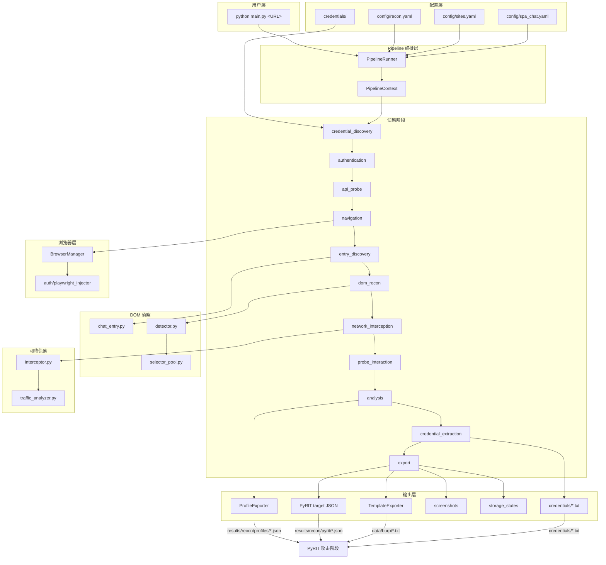

# pyrit-web-recon

专注于侦察**基于 LLM 的 AI Web 应用**：AI 聊天助手、Copilot、Agent、RAG 知识库、模型 Playground 等。

本工具不是通用 Web 漏洞扫描器，也不会处理与 LLM 无关的传统 Web 应用；所有设计（入口发现、DOM 侦察、流量分析、攻击面识别）都围绕 LLM 应用展开，输出供后续 PyRIT 等 AI Red Team 框架消费。

## 核心能力

- **智能入口发现**：自动发现 AI 助手 / 客服 / Copilot / Agent 浮动按钮，支持 900+ 内置选择器 + 评分扫描兜底。
- **DOM 侦察**：评分机制识别输入框、发送按钮、响应区。
- **三级发送降级**：Enter 键 → 发送按钮点击 → 父容器点击，适配各类 LLM 聊天界面。
- **网络流量分析**：拦截 XHR/fetch/WebSocket，识别 OpenAI / Claude / Gemini / 文心 / 通义 / 星火 / Kimi / DeepSeek / Ollama 等 LLM API，解析 SSE / JSON 响应并提取模型名、通信协议（SSE / WebSocket / gRPC-Web）。
- **LLM 特征识别**：从流量中提取 API Key / Bearer Token 线索，识别 RAG（知识库 / 检索 / 向量）与 Agent / Copilot / MCP 组件特征。
- **认证注入**：从 `credentials/{domain}.txt` 解析 Headers，自动注入 Cookie / Bearer / 自定义头，支持 storage_state 复用。
- **人工登录等待**：检测到登录页时自动暂停，等待用户完成账号密码、验证码、拼图/滑块、OTP/扫码等登录步骤，完成后自动继续侦察。
- **凭据自动保存**：登录成功后自动从浏览器提取 Cookie / Token 并保存到 `credentials/{domain}.txt`，后续侦察可直接复用。
- **标准化输出**：生成 `TargetProfile` JSON/YAML，导出 Burp / Repeater 攻击模板，并输出 PyRIT 兼容的 target 配置。
- **Pipeline 编排**：11 个侦察阶段串行执行，阶段结果友好展示，失败自动终止。

## 项目结构

```text
pyrit-web-recon/
├── config/
│   ├── recon.yaml              # 全局侦察配置
│   ├── sites.yaml              # 已知站点选择器
│   └── spa_chat.yaml           # SPA 侦察配置
├── credentials/                # 按域名存放 Headers 凭据
├── src/
│   ├── auth/                   # 认证解析、注入、自动填充与自动提取
│   │   ├── header_parser.py
│   │   ├── playwright_injector.py
│   │   ├── credential_extractor.py
│   │   └── form_filler.py
│   ├── browser_manager.py      # Playwright 生命周期
│   ├── credential_manager.py   # 凭据解析与适配
│   ├── dom/                    # DOM 侦察
│   │   ├── selector_pool.py
│   │   ├── chat_entry.py
│   │   └── detector.py
│   ├── network/                # 网络流量分析
│   │   ├── interceptor.py
│   │   └── traffic_analyzer.py
│   ├── utils/                  # 通用工具
│   │   └── login_waiter.py
│   ├── recon/                  # 侦察数据契约
│   │   └── target_profile.py
│   ├── interaction/            # Web 聊天交互
│   │   └── web_chat.py
│   ├── export/                 # 结果导出
│   │   ├── template_exporter.py
│   │   └── profile_exporter.py
│   └── pipeline/               # 流水线引擎与阶段
│       ├── base.py             # PipelineStage 基类
│       ├── context.py          # PipelineContext / StageResult
│       ├── runner.py           # PipelineRunner
│       └── stages/             # 侦察阶段实现
│           ├── credential_discovery.py
│           ├── authentication.py
│           ├── api_probe.py
│           ├── navigation.py
│           ├── entry_discovery.py
│           ├── dom_recon.py
│           ├── network_interception.py
│           ├── probe_interaction.py
│           ├── analysis.py
│           ├── credential_extraction.py
│           └── export.py
├── tests/
│   └── mock_llm_server.py      # 本地 Mock LLM 服务器（完整流水线测试）
├── .assistant/
│   └── rules.md                # 项目规则（跨 IDE 可读）
├── .env.example                # 环境变量配置示例
├── main.py                     # CLI 入口（PipelineRunner 编排）
└── requirements.txt
```

## 快速开始

### 安装依赖

```bash
pip install -r requirements.txt
playwright install chromium
```

### 配置目标（推荐）

复制示例环境变量文件并填写目标：

```bash
cp .env.example .env
```

编辑 `.env`，只需填写目标 URL：

```text
RECON_TARGET_URL=https://tongyi.aliyun.com/qianwen/
```

对于需要先登录的目标，还可以（可选）填写用户名/密码，Pipeline 会在检测到登录页后自动填充表单，但点击登录、验证码、滑块/拼图等二次验证仍需人工完成：

```text
RECON_USERNAME=your_username
RECON_PASSWORD=your_password
```

其他参数均已内置最优默认值，通常无需修改。如需覆盖（无头模式、人工登录、探测消息等），可运行 `python main.py --help` 查看后按需添加到 `.env`。

配置后可直接运行：

```bash
python main.py
```

### 运行侦察

```bash
# 自动侦察
python main.py https://example.com/ai-chat

# 指定为 SPA
python main.py https://example.com/ai-chat --type spa

# 无头模式
python main.py https://example.com/ai-chat --headless

# 不发送探测消息
python main.py https://example.com/ai-chat --no-send

# 纯 API 目标（Ollama / OpenAI 兼容）
python main.py http://localhost:11434/v1/chat/completions --type api

# 人工登录场景（京东/淘宝/企业门户等需先登录）
python main.py https://example.com/ai-chat --manual-login

# 人工登录，超时 10 分钟，自动填充账号密码后自动接管后续流程
python main.py https://example.com/ai-chat --manual-login --manual-login-timeout 600 --username user --password pass

# 人工登录，检测到登录完成后仍需按 Enter 确认才继续
python main.py https://example.com/ai-chat --manual-login --manual-login-require-enter

# 跨域登录：起始页 www.jd.com，登录页 passport.jd.com，成功后跳转回 www.jd.com
python main.py https://www.jd.com --manual-login --login-url "https://passport.jd.com/new/login.aspx"

# 站点别名（配置在 config/sites.yaml）
python main.py kimi --type spa
```

### 本地完整流水线测试

使用内置 Mock LLM 服务器，无需外部网络和账号：

```bash
# 终端 1：启动 Mock 服务器
python tests/mock_llm_server.py

# 终端 2：运行完整流水线
python main.py http://127.0.0.1:18080 --type spa --headless
```

测试完成后，可在 `results/recon/` 查看 Profile、PyRIT target、截图等输出。

### 人工登录流程

对于京东、淘宝、企业门户等需要先登录的目标，流水线支持**自动填充 + 人工完成验证 + 自动接管**：

1. （可选）在 `.env` 或命令行提供用户名/密码：

   ```text
   RECON_USERNAME=your_username
   RECON_PASSWORD=your_password
   ```

   或命令行：

   ```bash
   python main.py https://www.jd.com --username your_username --password your_password
   ```

2. 启动时添加 `--manual-login`，可指定登录页 URL：

   ```bash
   python main.py https://www.jd.com --manual-login --login-url "https://passport.jd.com/new/login.aspx"
   ```

3. 流水线导航到登录页后：
   - 如果配置了用户名/密码，会自动填充到登录表单（不会点击登录按钮）。
   - 终端弹出提示，要求用户在浏览器中完成以下任意组合操作：
     - 点击登录按钮
     - 短信/图片验证码
     - 滑块/拼图验证
     - OTP / 扫码登录

4. 默认情况下，Pipeline 会自动检测登录成功并继续后续侦察，无需按 Enter。
   如果需要手动确认，可添加 `--manual-login-require-enter`。

5. 流水线自动继续后续阶段，无需再次手动干预：
   - 保存浏览器凭据到 `credentials/{domain}.txt`
   - 返回目标域继续侦察
   - 发现聊天入口、拦截 LLM API、输出结果

### 认证

从浏览器 F12 复制 Request Headers，保存到：

```text
credentials/example.com.txt
```

工具会自动按域名匹配并注入 Cookie / Authorization。

## 输出

- `results/recon/profiles/*.json`：标准化 TargetProfile
- `results/recon/profiles/*.yaml`：YAML 格式 TargetProfile
- `results/recon/pyrit/*_pyrit_target.json`：PyRIT 兼容 target 配置
- `data/burp/*_api.txt`：API 攻击模板
- `data/burp/*_webui.txt`：Web UI 选择器模板
- `results/recon/screenshots/`：侦察截图
- `results/recon/storage_states/`：浏览器状态
- `results/recon/latest_summary.txt`：文本摘要

## 完整架构流程图


